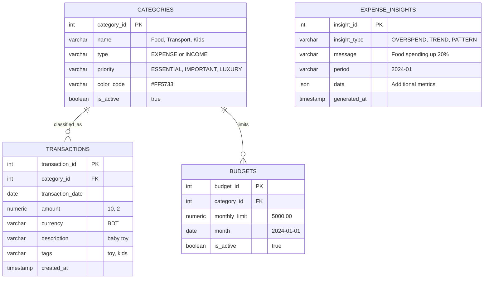

# 🔴 MonyBug: Full-Stack Personal Expense Manager

## ✨ Overview

MonyBug is a high-performance, full-stack personal finance application designed for meticulous expense tracking and financial analysis. It's structured as a Monorepo to efficiently manage the separate but cohesive backend API and the cross-platform frontend clients.

Our primary goal is to provide a reliable, fast, and secure tool, leveraging the power of Go for backend efficiency and PostgreSQL for rock-solid transactional integrity, ensuring accurate financial reporting every time.

## 🚀 Key Features

- **Transactional Integrity**: Leveraging PostgreSQL for guaranteed ACID compliance in all financial data
- **Multi-Platform Clients**: Dedicated React.js web application and native Android app (Java/Kotlin) for optimal platform-specific user experience
- **Custom Categories**: Users can define custom income and expense categories with priorities and color coding
- **Budget Management**: Set monthly spending limits per category with tracking and alerts
- **Detailed Reporting**: Generate monthly, quarterly, and annual summaries based on category and type (INCOME/EXPENSE)
- **Expense Insights**: AI-generated spending analysis and pattern recognition
- **High Performance**: API endpoints optimized using the Go programming language and Gin framework

## 🛠️ Technology Stack

MonyBug is built on a robust, type-safe, and high-performance stack, maximizing maintainability and scalability.

### Backend (API)

| Component | Technology | Rationale |
|-----------|------------|----------|
| Language | Go (Golang) | Excellent concurrency, compiled performance, and low resource usage |
| Framework | Gin | Fast, minimalist HTTP web framework for building performant REST APIs |
| Database | PostgreSQL | Industry standard for transactional systems, ensuring data reliability |
| ORM | GORM | Type-safe database operations with auto-migrations |
| Architecture | Clean Architecture | Clear separation of concerns (Models, Repositories, Handlers) |

### Frontend (Clients)

| Component | Technology | Rationale |
|-----------|------------|----------|
| Web Framework | React.js | Modern, component-based architecture with rich ecosystem |
| Android Framework | Java/Kotlin (Native) | Native development for optimal performance and platform integration |
| Language (Web) | TypeScript | Static typing for better code quality and developer experience |
| Language (Android) | Kotlin | Modern, concise syntax with full Java interoperability |

## 🏗️ Monorepo Structure

The project utilizes a standard monorepo layout for efficient development and deployment separation:

```
monybug-monorepo/
├── backend/                    # Go/Gin API server
│   ├── cmd/
│   │   └── main.go             # Application entry point
│   ├── internal/               # Core business logic
│   │   ├── database/           # Database connections & migrations
│   │   ├── handlers/           # HTTP request handlers
│   │   ├── models/             # GORM data models
│   │   ├── repositories/       # Data access layer
│   │   └── routes/             # API route definitions
│   ├── migrations/             # SQL migration files
│   ├── docs/                   # API documentation
│   ├── .env                    # Environment variables
│   └── go.mod                  # Go dependencies
├── web-client/                 # React.js web application
│   ├── src/                    # React components & pages
│   ├── public/                 # Static assets
│   └── package.json            # Node.js dependencies
├── android-client/             # Native Android application
│   ├── app/                    # Android app module
│   └── build.gradle            # Android build configuration
├── docs/                       # Project documentation
└── README.md                   # This file
```    


## 📚 Project Documentation & Schema

Detailed technical documentation, including the database schema and API specifications, is available in the dedicated docs/ folder.

| Document | Description | Link |
|----------|-------------|------|
| Database Schema | Detailed SQL definitions for all tables, constraints, and indexes | [View Schema](docs/db-design/) |
| API Endpoints | Full specification of all available backend endpoints | [View API Spec](backend/docs/api-endpoints.md) |
| Backend Structure | System architecture and code organization | [View Structure](backend/docs/structure.md) |

## 📊 Entity-Relationship Diagram (ERD)

The core database design is visualized below using the Mermaid diagram standard:




## ⚙️ Getting Started

Follow these instructions to set up and run the MonyBug API and Client locally.

### Prerequisites

Ensure the following are installed on your machine:

- Go (1.21+)
- PostgreSQL (version 12+)
- Node.js (LTS) and npm/Yarn
- Git
- Android Studio (for Android client)

### Step 1: Clone the Repository

```bash
git clone https://github.com/yourusername/monybug-monorepo.git
cd monybug-monorepo
```

### Step 2: Database Setup

Create a new PostgreSQL database:

```sql
CREATE DATABASE monybug_db;
```

### Step 3: Run the Backend (Go/Gin API)

Navigate to Backend:

```bash
cd backend
```

Configure Environment - Create `.env` file:

```env
DB_HOST=localhost
DB_PORT=5432
DB_USER=postgres
DB_PASSWORD=your_password
DB_NAME=monybug_db
API_PORT=8080
```

Install dependencies and run:

```bash
go mod tidy
go run cmd/main.go
# The API will be running at http://localhost:8080
# Migrations run automatically on startup
```


### Step 4: Run the Web Client (React.js)

Navigate to Web Client:

```bash
cd ../web-client
```

Install Dependencies:

```bash
npm install
# or yarn install
```

Start the Development Server:

```bash
npm start
# or yarn start
```

The web application will open at http://localhost:3000

### Step 5: Run the Android Client (Optional)

Navigate to Android Client:

```bash
cd ../android-client
```

Open in Android Studio:

1. Open the `android-client` folder in Android Studio
2. Sync Gradle files
3. Run on emulator or device

## 🤝 Contributing

We welcome all contributions! Whether it's reporting a bug, suggesting a feature, or submitting a pull request, please check our Contributing Guidelines (to be created) for more information.

## 📜 License

This project is licensed under the MIT License. See the LICENSE file for more details.

---

**Developed with Go, Gin, PostgreSQL, React.js, and Kotlin.**
